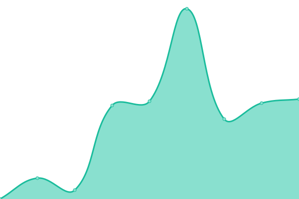
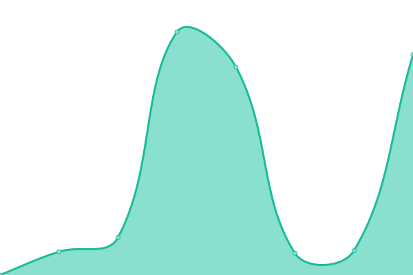
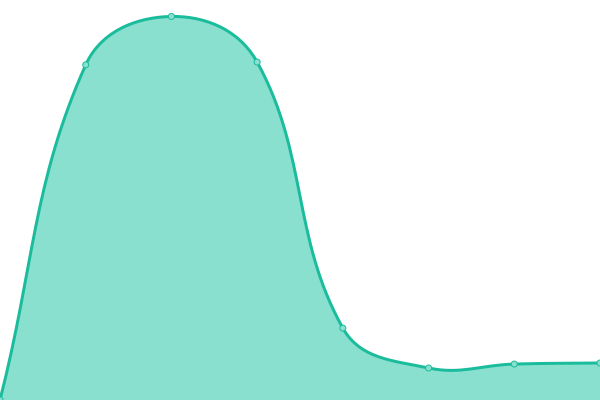

# [📈 Live Status](https://mirea-ninja.github.io/upptime/): <!--live status--> **🟧 Partial outage**

This repository contains the open-source uptime monitor and status page for [Mirea Ninja Upptime](https://mirea-ninja.github.io/upptime/), powered by [Upptime](https://github.com/upptime/upptime).

With [Upptime](https://upptime.js.org), you can get your own unlimited and free uptime monitor and status page, powered entirely by a GitHub repository. We use [Issues](https://github.com/mirea-ninja/upptime/issues) as incident reports, [Actions](https://github.com/mirea-ninja/upptime/actions) as uptime monitors, and [Pages](https://mirea-ninja.github.io/upptime) for the status page.

<!--start: status pages-->
<!-- This summary is generated by Upptime (https://github.com/upptime/upptime) -->
<!-- Do not edit this manually, your changes will be overwritten -->
<!-- prettier-ignore -->
| URL | Status | History | Response Time | Uptime |
| --- | ------ | ------- | ------------- | ------ |
|  [Mirea Ninja](https://mirea.ninja/) | 🟩 Up | [mirea-ninja.yml](https://github.com/mirea-ninja/upptime/commits/HEAD/history/mirea-ninja.yml) | 

 3724ms
     
 | 

<a href="https://mirea-ninja.github.io/upptime/history/mirea-ninja">100.00%</a>
    

|  [Schedule API](https://schedule.mirea.ninja/api/schedule/groups) | 🟩 Up | [schedule-api.yml](https://github.com/mirea-ninja/upptime/commits/HEAD/history/schedule-api.yml) | 

 4197ms
     
 | 

<a href="https://mirea-ninja.github.io/upptime/history/schedule-api">100.00%</a>
    

|  [CMS Strapi](https://cms.mirea.ninja/) | 🟩 Up | [cms-strapi.yml](https://github.com/mirea-ninja/upptime/commits/HEAD/history/cms-strapi.yml) | 

 3122ms
     
 | 

<a href="https://mirea-ninja.github.io/upptime/history/cms-strapi">100.00%</a>
    

|  [Moodle Backend](https://mirea.ninja:5000/) | 🟥 Down | [moodle-backend.yml](https://github.com/mirea-ninja/upptime/commits/HEAD/history/moodle-backend.yml) | 

 0ms
     
 | 

<a href="https://mirea-ninja.github.io/upptime/history/moodle-backend">0.00%</a>
    

|  [Assistants API](https://assistants.mirea.ninja/api/v1/uptime) | 🟥 Down | [assistants-api.yml](https://github.com/mirea-ninja/upptime/commits/HEAD/history/assistants-api.yml) | 

 621ms
     
 | 

<a href="https://mirea-ninja.github.io/upptime/history/assistants-api">0.10%</a>
    

<!--end: status pages-->

[**Visit our status website →**](https://mirea-ninja.github.io/upptime/)

## 📄 License

- Powered by: [Upptime](https://github.com/upptime/upptime)
- Code: [MIT](./LICENSE) © [Upptime](https://upptime.js.org)
- Data in the `./history` directory: [Open Database License](https://opendatacommons.org/licenses/odbl/1-0/)
